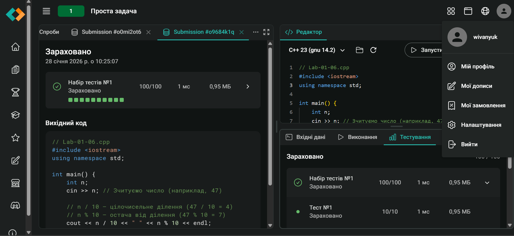

# Програмування

# Лабораторна робота № 1
# Тема: БАЗОВІ ЕЛЕМЕНТИ МОВИ ТА ЛІНІЙНІ ПРОГРАМИ

## Виконавець: 
## Студент: Шевченко А.А.
## Група: KN1-B25

### Завдання 1.
Варіант: Приклад (Типовий)

#### Умова завдання
Дано два дійсних числа a та b. Знайти їх середнє арифметичне та середнє геометричне їхніх модулів.
Математична модель:
* Середнє арифметичне: $Avg = (a + b) / 2$
* Середнє геометричне модулів: $Geo = \sqrt{|a| \cdot |b|}$

#### Програмна реалізація
```cpp
// Lab-01-01.cpp
#include <iostream>
#include <cmath>    // Потрібна для sqrt() та fabs()
#include <iomanip>  // Потрібна для setprecision (красиве виведення)

using namespace std;

int main() {
    double a, b;

    cout << "Enter a and b: ";
    cin >> a >> b;

    double arithmetic_mean = (a + b) / 2.0;
    // fabs(x) повертає модуль дійсного числа |x|
    double geometric_mean = sqrt(fabs(a) * fabs(b));

    cout << fixed << setprecision(3); // Налаштування: 3 знаки після коми
    cout << "Arithmetic mean: " << arithmetic_mean << endl;
    cout << "Geometric mean:  " << geometric_mean << endl;

    return 0;
}
```
#### Результати виконання та їх аналіз
Програма коректно обчислила середні значення.
Вхідні дані: 5 та -6.

* Середнє арифметичне: $(5 + (-6)) / 2 = -0.5$.
* Середнє геометричне: $\sqrt{|5| \cdot |-6|} = \sqrt{30} \approx 5.477$.

Результат консолі:
```text
Enter a and b: 5 -6
Arithmetic mean: -0.500
Geometric mean:  5.477
```
### Завдання 2.
Варіант: Приклад (Типовий)

#### Умова завдання
Швидкість автомобіля задана в милях на годину (mph). Перевести її в кілометри на годину (km/h) та метри на секунду (m/s). Відомо, що 1 миля = 1.60934 км.

#### Програмна реалізація
```cpp
// Lab-01-02.cpp
#include <iostream>
using namespace std;

int main() {
    const double KM_IN_MILE = 1.60934; // Константа переведення

    double speed_mph;
    cout << "Enter speed (mph): ";
    cin >> speed_mph;

    double speed_kmh = speed_mph * KM_IN_MILE;

    // Щоб перевести км/год у м/с, треба поділити на 3.6 (1000 м / 3600 с)
    double speed_ms = speed_kmh / 3.6;

    cout << "Speed in km/h: " << speed_kmh << endl;
    cout << "Speed in m/s:  " << speed_ms << endl;

    return 0;
}
```
#### Результати виконання та їх аналіз
Програма виконала конвертацію одиниць вимірювання.
Вхідні дані: `100` mph.

Результат консолі:
```text
Enter speed (mph): 100
```

### Завдання 3.
Варіант: Приклад (Типовий)

#### Умова завдання
Дано катети прямокутного трикутника a та b. Знайти довжину гіпотенузи c, площу S та периметр P.

#### Програмна реалізація
```cpp
// Lab-01-03.cpp
#include <iostream>
#include <cmath>
using namespace std;

int main() {
    double leg1, leg2;
    cout << "Enter two legs of the triangle: ";
    cin >> leg1 >> leg2;

    // pow(x, 2) підносить до квадрату, sqrt() бере корінь
    double hypotenuse = sqrt(pow(leg1, 2) + pow(leg2, 2));

    double area = 0.5 * leg1 * leg2; // Важливо писати 0.5, а не 1/2 (бо 1/2 дасть 0)
    double perimeter = leg1 + leg2 + hypotenuse;

    cout << "Hypotenuse: " << hypotenuse << endl;
    cout << "Area:        " << area << endl;
    cout << "Perimeter:  " << perimeter << endl;

    return 0;
}
Speed in km/h: 160.934
Speed in m/s:  44.7039
```

#### Результати виконання та їх аналіз
Обчислення для трикутника з катетами 2 і 2 (рівнобедрений прямокутний).
Гіпотенуза: $\sqrt{4+4} = \sqrt{8} \approx 2.828$.

Результат консолі:
```text
Enter two legs of the triangle: 2 2
Hypotenuse: 2.82843
Area:        2
Perimeter:  6.82843
```

### Завдання 4.
Варіант: Приклад (Типовий)

#### Умова завдання
Обчислити кінетичну енергію тіла масою $m$ (кг), що рухається зі швидкістю $v$ (м/с). Формула: $E = \frac{mv^2}{2}$.

#### Програмна реалізація
```cpp
// Lab-01-04.cpp
#include <iostream>
using namespace std;

int main() {
    double mass, velocity;

    cout << "Enter mass (kg) and velocity (m/s): ";
    cin >> mass >> velocity;

    // Варіант запису без pow (швидше для простих квадратів)
    double energy = (mass * velocity * velocity) / 2.0;

    cout << "Kinetic Energy: " << energy << " Joules" << endl;

    return 0;
}
```

#### Результати виконання та їх аналіз
Вхідні дані: Маса 100 кг, Швидкість 9 м/с.
Енергія: $100 \cdot 81 / 2 = 4050$.

Результат консолі:
```text
Enter mass (kg) and velocity (m/s): 100 9
Kinetic Energy: 4050 Joules
```

### Завдання 5.
Варіант: Приклад (Типовий)

#### Умова завдання
Обчислити значення виразу $z = \cos^2(x) + \sin(2x)$, де $x$ вводиться в градусах.
Попередньо необхідно перевести градуси в радіани.

#### Програмна реалізація
```cpp
// Lab-01-05.cpp
#include <iostream>
#include <cmath> // Для sin, cos, pow, M_PI

// Якщо M_PI не визначено у вашому компіляторі, розкоментуйте рядок нижче:
// const double M_PI = 3.14159265358979323846;

using namespace std;

int main() {
    double x_deg;
    cout << "Enter angle x (in degrees): ";
    cin >> x_deg;

    // 1. Переведення в радіани
    double x_rad = x_deg * M_PI / 180.0;

    // 2. Обчислення за формулою
    // Увага: cos^2(x) записується як pow(cos(x), 2) або cos(x)*cos(x)
    double z = pow(cos(x_rad), 2) + sin(2 * x_rad);

    cout << "Result z = " << z << endl;

    return 0;
}
```

#### Результати виконання та їх аналіз
Вхідні дані: 45 градусів.
$\cos(45^\circ) \approx 0.707$, $\cos^2 = 0.5$.
$\sin(2 \cdot 45^\circ) = \sin(90^\circ) = 1$.
Сума: $0.5 + 1 = 1.5$.

Результат консолі:
```text
Enter angle x (in degrees): 45
Result z = 1.5
```

### Завдання 6.
Варіант: E-olymp (Задача №1 "Проста задача")

#### Умова завдання
Напишіть програму, яка читає двоцифрове ціле число і виводить обидві цифри через пробіл.
Задача розміщена на платформі e-olymp за посиланням: [https://eolymp.com/uk/problems/1](https://eolymp.com/uk/problems/1)

#### Програмна реалізація
```cpp
// Lab-01-06.cpp
#include <iostream>
using namespace std;

int main() {
    int n;
    cin >> n; // Зчитуємо число (наприклад, 47)

    // n / 10 — цілочисельне ділення (47 / 10 = 4)
    // n % 10 — остача від ділення (47 % 10 = 7)
    cout << n / 10 << " " << n % 10 << endl;

    return 0;
}
```

#### Результати виконання та їх аналіз
Код був відправлений на перевірку в систему e-olymp.
Всі тести пройдено успішно.

**Скріншот результату (Accepted):**


